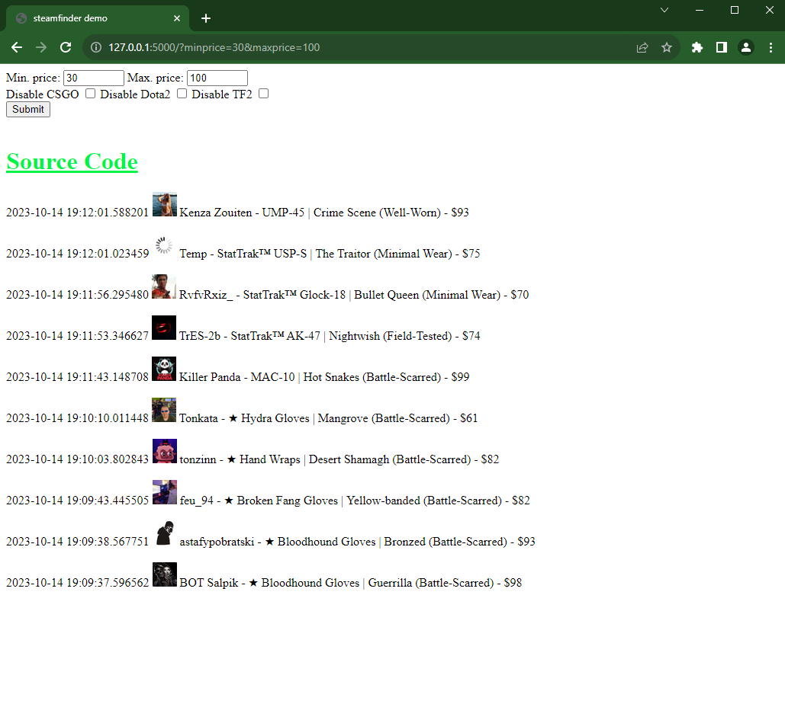

# AvatarFinder + MarketFinder

|  |  |
| :    Scraping data whose price is between 30 and 100    : | :----------------------------------------------------------: | :----------------------------------------------------------: |

### requirements
 - Python 3
 - PostgreSQL + 150GB SSD Storage

#### create tables and indexes in psql
```sql
CREATE TABLE users(
    steam64id bigint,
    avatar VARCHAR(200),
    PRIMARY KEY(steam64id)
);

CREATE INDEX avatar_index ON users (avatar);


CREATE TABLE listings(
    id SERIAL PRIMARY KEY,
    game int,
    item_name VARCHAR(200),
    time timestamp,
    price int,
    owner_name VARCHAR(200),
    owner_avatar VARCHAR(200),
    owner_steamid VARCHAR(200) UNIQUE,
    CONSTRAINT owner_item_constraint UNIQUE(owner_name, item_name)
);

CREATE INDEX ON listings(owner_name);
CREATE INDEX ON listings(item_name);
```

#### populate database with users
set API_KEY environment variable, edit steamid range if necessary and run `databaseupdater.py`

#### collect listings from steam
run `listingcollector.py`. it takes items from `listings.json`. you can re-generate dictionary with 
`helpers.collect_item_urls` and `helpers.parse_id`

#### web-server
flask code is contained in `app.py` 

