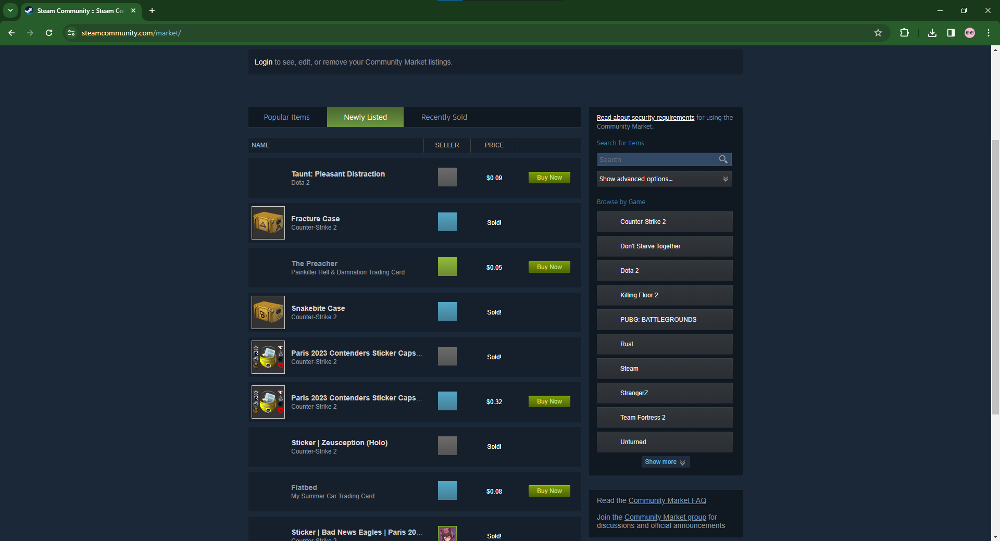
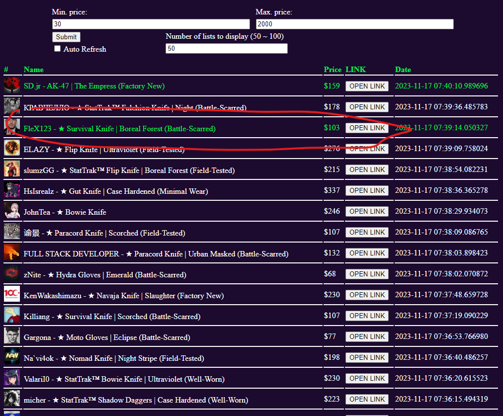
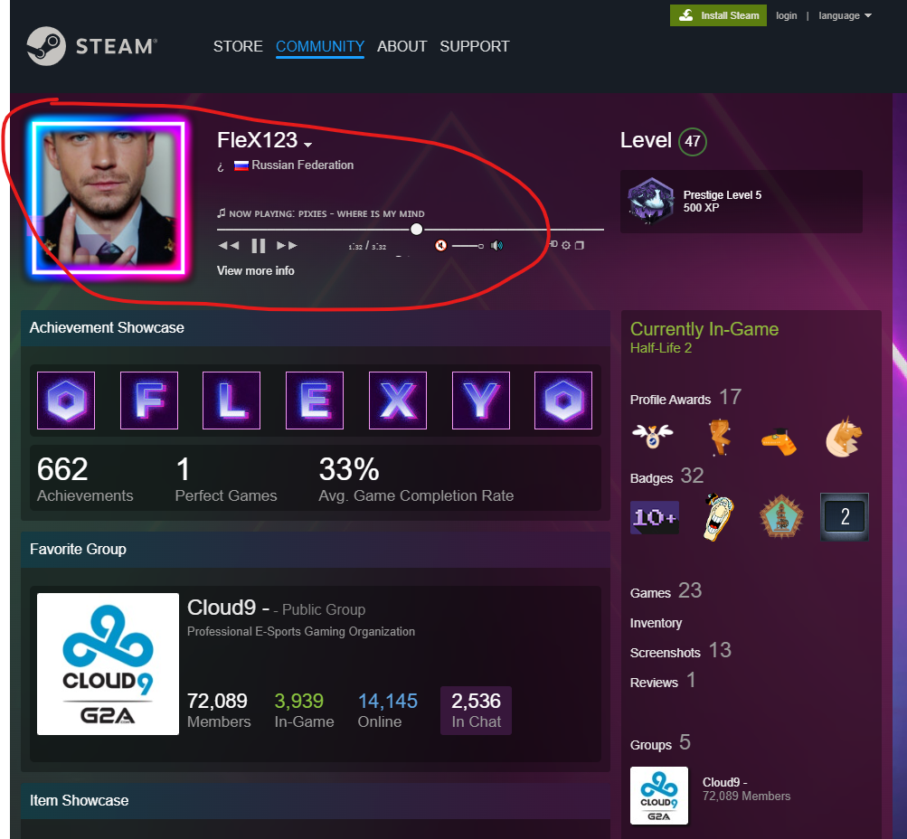

# AvatarFinder + MarketFinder
Specify the range of data to be scraped by specifying the Min Price and Max Price values.

|  |
|  |  |
| :---Scraping data whose price is between 30 and 100---: | :---Scraping data whose price is between 300 and 400---: |

### requirements
 - Python 3
 - PostgreSQL + 150GB SSD Storage

#### create tables and indexes in psql
```sql
CREATE TABLE listings(
    id SERIAL PRIMARY KEY,
    item_name VARCHAR(200),
    time timestamp,
    price int,
    owner_name VARCHAR(200),
    owner_avatar VARCHAR(200),
    profile_link VARCHAR(200),
    CONSTRAINT owner_item_constraint UNIQUE(owner_name, item_name, price, profile_link)
);

CREATE INDEX ON listings(owner_name);
CREATE INDEX ON listings(item_name);
CREATE INDEX ON listings(price);
CREATE INDEX ON listings(profile_link);
```

#### populate database with users
set API_KEY environment variable, edit steamid range if necessary and run `databaseupdater.py`

#### collect listings from steam
run `listingcollector.py`. it takes items from `listings.json`. you can re-generate dictionary with 
`helpers.collect_item_urls` and `helpers.parse_id`

#### web-server
flask code is contained in `app.py` 

